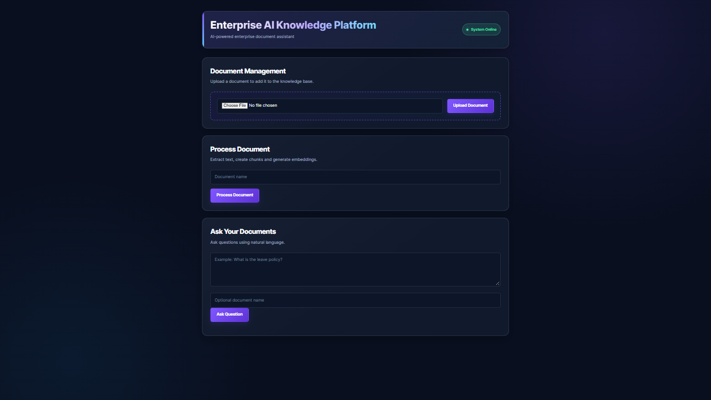

# Enterprise AI Knowledge Platform

An enterprise-focused document intelligence platform that enables users to upload business documents, build a searchable knowledge base, and ask questions using Retrieval-Augmented Generation (RAG).

The application combines document processing, semantic search, hybrid retrieval, reranking, and LLM-based response generation to provide answers grounded in uploaded documents.



## Technology Stack

<p align="left">      </p>
<p align="left">      </p>
<p align="left">     </p>

## Live Demo

**Application:** Link will be provided soon...

**Portfolio:** [Visit my AI Engineer Portfolio](https://portfolio-webiste-kf65.onrender.com/)

> The demo is hosted on Render. The first request may take longer if the service has been inactive.

## Overview

Enterprise documents often contain useful information, but finding the right answer across multiple files can be time-consuming.

This project provides a simple interface for:

* Uploading PDF, DOCX, and TXT documents
* Extracting and cleaning document text
* Splitting documents into searchable chunks
* Creating vector embeddings
* Storing embeddings in Qdrant
* Searching documents using semantic and keyword-based retrieval
* Reranking retrieved results
* Generating answers using an LLM
* Displaying document sources with the generated answer

The project is designed as a practical demonstration of how an enterprise knowledge assistant can be built using a modular Python backend and a lightweight Flask frontend.

## Key Features

### Document Ingestion

* Supports PDF, DOCX, and TXT files
* Extracts text from uploaded documents
* Cleans extracted content
* Splits documents into overlapping chunks
* Generates embeddings for each chunk
* Stores document chunks and metadata in Qdrant

### Knowledge Base Search

* Semantic vector search
* Keyword-based retrieval
* Hybrid retrieval workflow
* Result reranking
* Optional document-level filtering

### RAG Question Answering

* Accepts natural-language questions
* Retrieves relevant document content
* Generates answers using retrieved context
* Returns source document information
* Avoids relying only on the model’s general knowledge

### Web Interface

* Flask/Jinja2-based frontend
* Document upload and processing workflow
* Question-answering interface
* Loading, success, and error states
* Responsive dark-themed UI
* Portfolio navigation and project branding

## Application Workflow

```text
Upload Document
      ↓
Extract Text
      ↓
Clean and Chunk Content
      ↓
Generate Embeddings
      ↓
Store Chunks in Qdrant
      ↓
Ask a Question
      ↓
Retrieve Relevant Chunks
      ↓
Hybrid Search and Reranking
      ↓
Generate Answer with LLM
      ↓
Display Answer and Sources
```

## Technology Stack

### Backend

* Python
* Flask
* Object-oriented service-layer architecture
* Flask Blueprints
* REST APIs

### Document Processing

* PDF text extraction
* DOCX text extraction
* TXT file processing
* Text cleaning and chunking

### AI and Retrieval

* Retrieval-Augmented Generation (RAG)
* OpenAI models
* Embeddings
* Qdrant vector database
* Semantic search
* Keyword search
* Reranking

### Frontend

* HTML5
* CSS3
* Flask/Jinja2 templates
* Vanilla JavaScript
* Responsive UI design

### Deployment

* Render
* Gunicorn
* Qdrant Cloud
* Environment-based configuration

## Project Structure

```text
enterprise-ai-knowledge-platform/
│
├── app.py
├── config.py
├── requirements.txt
├── README.md
│
├── routes/
│   ├── ingestion_routes.py
│   ├── rag_routes.py
│   └── frontend_routes.py
│
├── services/
│   ├── ingestion_service.py
│   ├── embedding_service.py
│   ├── vector_store.py
│   ├── retrieval_service.py
│   ├── reranker.py
│   └── rag_service.py
│
├── ingestion/
│   ├── document_loader.py
│   ├── text_cleaner.py
│   └── chunker.py
│
├── evaluation/
│   ├── evaluator.py
│   ├── test_questions.json
│   └── run_evaluation.py
│
├── templates/
│   └── index.html
│
├── static/
│   ├── css/
│   │   └── style.css
│   └── js/
│       └── app.js
│
├── data/
│   ├── uploads/
│   └── qdrant/
│
└── utils/
    ├── logger.py
    └── exceptions.py
```

> The exact structure may evolve as additional evaluation, monitoring, and agentic workflow features are introduced.

## API Endpoints

### Upload Document

```http
POST /api/documents/upload
```

Uploads a supported document and returns information about the saved file.

### Process Document

```http
POST /api/documents/process
```

Processes the uploaded document, creates chunks and embeddings, and stores the data in Qdrant.

Example request:

```json
{
  "file_path": "data/uploads/document.pdf"
}
```

### Ask a Question

```http
POST /api/rag/query
```

Example request:

```json
{
  "question": "What is the leave entitlement for confirmed employees?"
}
```

A document-specific query can include:

```json
{
  "question": "What is the leave entitlement?",
  "document_name": "leave_policy.pdf"
}
```

## Local Setup

### 1. Clone the repository

```bash
git clone https://github.com/your-username/enterprise-ai-knowledge-platform.git
cd enterprise-ai-knowledge-platform
```

### 2. Create a virtual environment

```bash
python -m venv venv
```

Activate it on Windows:

```bash
venv\Scripts\activate
```

Activate it on macOS/Linux:

```bash
source venv/bin/activate
```

### 3. Install dependencies

```bash
pip install -r requirements.txt
```

### 4. Configure environment variables

Create a `.env` file in the project root:

```env
OPENAI_API_KEY=your_openai_api_key
QDRANT_URL=your_qdrant_cloud_url
QDRANT_API_KEY=your_qdrant_api_key
```

Do not commit `.env` to the repository.

### 5. Run the application

```bash
python app.py
```

Open the application at:

```text
http://127.0.0.1:5000
```

## Deployment

The application can be deployed as a Flask web service on Render.

### Build Command

```bash
pip install -r requirements.txt
```

### Start Command

```bash
gunicorn app:app
```

Configure the following environment variables in Render:

```env
OPENAI_API_KEY
QDRANT_URL
QDRANT_API_KEY
```

For deployment, Qdrant Cloud is recommended instead of relying on local Qdrant storage.

## Design Decisions

### Why RAG?

RAG allows the application to retrieve relevant information from uploaded documents before generating a response. This helps make answers more relevant to the user’s own knowledge base and provides supporting source information.

### Why Qdrant?

Qdrant provides vector search capabilities for storing and retrieving document embeddings. It also supports metadata-based filtering, which is useful when users want to search within a specific document.

### Why Flask?

Flask keeps the application lightweight and easy to understand while providing enough flexibility for API development, template rendering, and integration with the service layer.

### Why a Service-Layer Architecture?

The application separates responsibilities across ingestion, embedding, vector storage, retrieval, reranking, and response generation services. This makes the code easier to test, debug, and extend.

## Current Scope

The current version focuses on the core document-to-answer workflow:

* Document upload
* Document processing
* Vector storage
* Retrieval
* Reranking
* RAG-based question answering
* Source display
* Basic evaluation and logging support

Advanced enterprise capabilities such as authentication, role-based access control, background job queues, document versioning, and multi-tenant isolation are outside the current scope.

## Future Improvements

Planned improvements include:

* Improved multi-document management
* Document processing status tracking
* Retrieval and answer evaluation
* Query rewriting for weak retrieval results
* Answer verification against source content
* Agentic RAG workflows using LangGraph
* Background document-processing jobs
* Authentication and role-based access control
* Document versioning
* Usage monitoring and analytics
* Persistent object storage for uploaded files

## Project Goals

This project was built to demonstrate practical experience in:

* Designing an AI-powered application
* Building a complete RAG pipeline
* Working with vector databases
* Integrating LLM APIs
* Structuring a maintainable Flask backend
* Connecting frontend interfaces with AI services
* Preparing an AI application for cloud deployment

## Author

**Dharmendra Yadav**

AI Engineer | Python | RAG | LangChain | LangGraph | MCP

* [Portfolio](https://portfolio-webiste-kf65.onrender.com/)
* [LinkedIn](https://www.linkedin.com/in/dharmendrayadav1996/)
